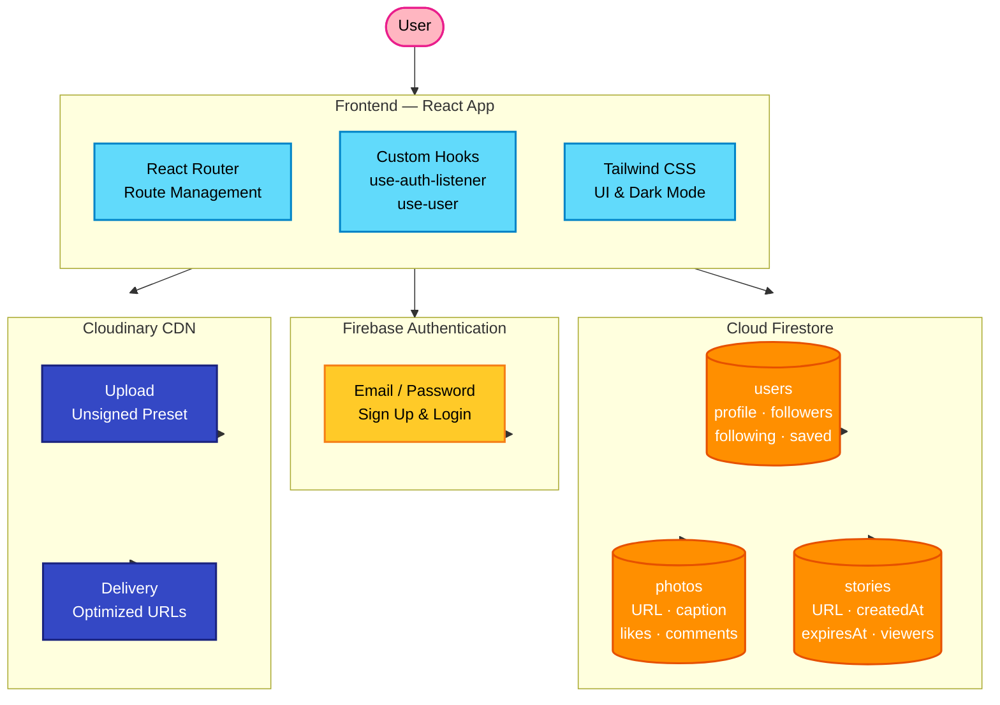
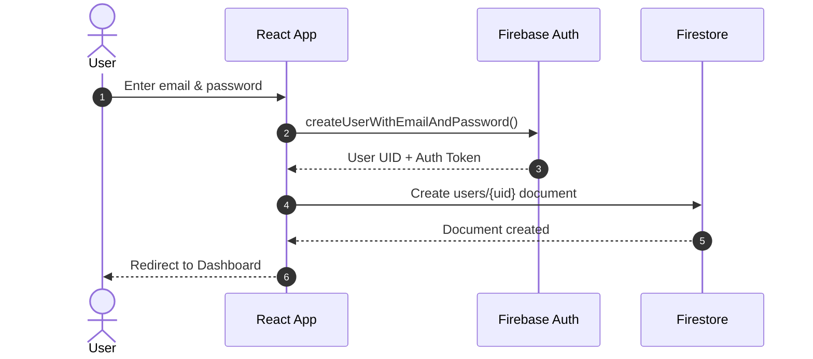
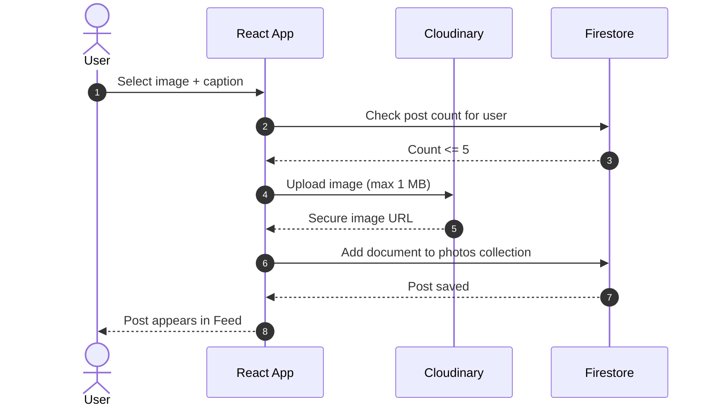
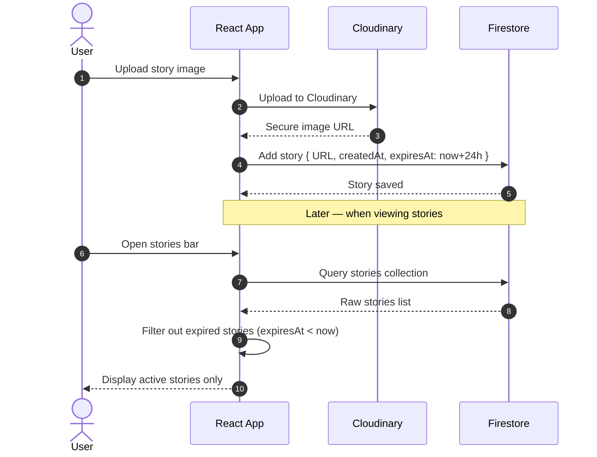
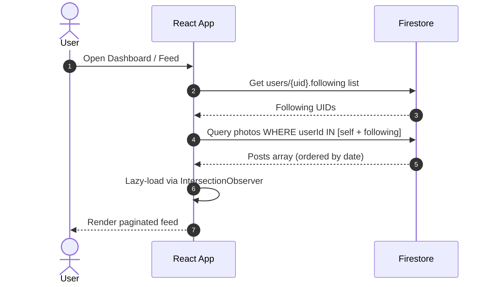
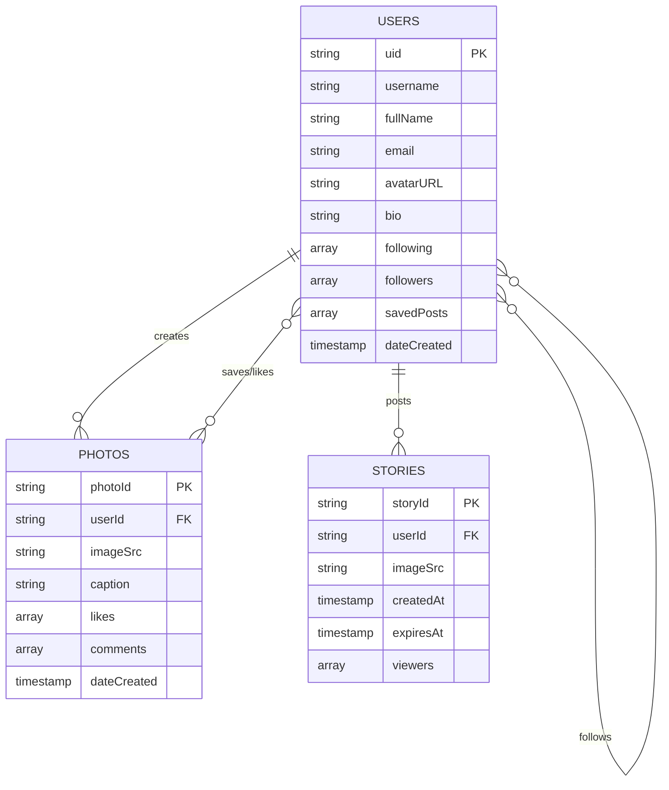
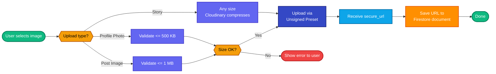

<div align="center">

# Instagram Clone

**A full-featured social photo-sharing app inspired by Instagram**

Built with **React** · **Firebase** · **Cloudinary** · **Tailwind CSS**

[](https://reactjs.org/)
[](https://firebase.google.com/)
[](https://cloudinary.com/)
[](https://tailwindcss.com/)

</div>

---

## Overview

Instagram Clone is a modern, full-stack social media application that replicates the core Instagram experience. Users can sign up, share photos, follow friends, react to posts, and browse stories — all powered by Firebase for the backend and Cloudinary for image hosting.

---

## Features

### Authentication & Routing
- Email/password authentication via **Firebase Authentication**
- Protected and public routes using `react-router-dom`
- Persistent auth state managed through custom hooks: `use-auth-listener`, `use-user`

### Feed & Posts
- Infinite-scrolling timeline showing photos from followed users and your own posts
- Lazy-loaded posts for performance using `LazyPost` + **Intersection Observer API**
- Likes, save/unsave, comments (add & delete), and human-readable timestamps
- Maximum **5 posts per user** enforced at the Firestore level

### Stories
- Instagram-style stories bar on the dashboard
- Story upload via **Cloudinary** with **24-hour expiry** tracked in Firestore
- Stories are automatically filtered out after expiry (client-side check)
- Minimal full-screen story viewer

### Profile
- Public profile pages with photo grid, followers/following counts, and bio
- Follow / unfollow other users in real time
- Edit profile: full name, bio, and profile photo upload via Cloudinary *(500 KB size limit)*

### Search & Suggestions
- User search page with live Firestore queries
- Sidebar "Suggestions for you" surfacing users you don't follow yet

---

## System Architecture



---

## Data Flow

### Authentication Flow



### Post Upload Flow



### Story Flow



### Feed Load Flow



---

## Firestore Data Model



---

## Image Upload Flow (Cloudinary)



---

## Tech Stack

| Layer | Technology | Purpose |
|---|---|---|
| **UI Framework** | React (CRA) | Component-based SPA |
| **Routing** | React Router DOM | Client-side navigation & protected routes |
| **Styling** | Tailwind CSS | Utility-first styles + dark mode |
| **Auth** | Firebase Authentication | Email/password login & signup |
| **Database** | Cloud Firestore | Real-time NoSQL document storage |
| **Image Hosting** | Cloudinary | Upload, transform & CDN delivery |
| **State Management** | Custom React Hooks | Auth state, user data |
| **Performance** | Intersection Observer | Lazy-loading posts in the feed |

---

## Project Structure

```
src/
├── components/
│   ├── header/          # Top navigation bar
│   ├── sidebar/         # Suggestions & user info
│   ├── post/            # Post card, likes, comments
│   ├── stories/         # Stories bar & viewer
│   └── profile/         # Profile grid & edit form
├── pages/
│   ├── dashboard.js     # Main feed page
│   ├── profile.js       # Public profile page
│   ├── login.js         # Auth pages
│   └── sign-up.js
├── hooks/
│   ├── use-auth-listener.js
│   └── use-user.js
├── services/
│   └── firebase.js      # Firebase config & helpers
└── helpers/
    └── cloudinary.js    # Upload utilities
```

---

### Constraints & Limits


| Feature | Limit |
| :--- | :--- |
| **Posts per user** | Max 5 |
| **Profile photo size** | Max 500 KB |
| **Post image size** | Max 1 MB |
| **Story duration** | 24 hours (auto-expired) |

### Connect with Me

- **Portfolio**: [maheshshinde-dev.vercel.app](https://maheshshinde-dev.vercel.app/)
- **GitHub**: [github.com/maheshshinde9100](https://github.com/maheshshinde9100)
- **LinkedIn**: [linkedin.com/in/maheshshinde9100](https://www.linkedin.com/in/maheshshinde9100)
- **Codolio**: [codolio.com/profile/mahesh.dev](https://codolio.com/profile/mahesh.dev)
