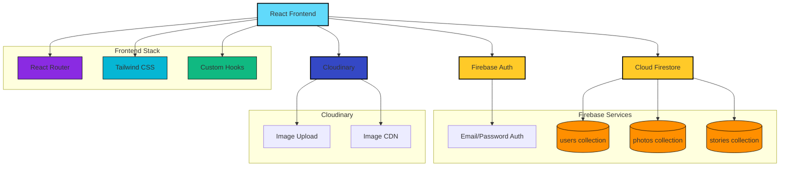

## Instagram Clone

A modern Instagram-like social app built with React, Tailwind CSS, Firebase, and Cloudinary.  
Users can sign up, log in, upload posts, create stories, like and comment on content, and manage their profile with a UI inspired by the real Instagram experience.

### Features

- **Authentication & Routing**
  - Email/password auth with Firebase Authentication.
  - Protected and public routes using `react-router-dom`.
  - Persistent auth state with custom hooks (`use-auth-listener`, `use-user`).

- **Feed & Posts**
  - Infinite-scrolling timeline showing photos from followed users and your own posts.
  - Lazy-loaded posts for performance (`LazyPost` + Intersection Observer).
  - Likes, save/unsave, comments (add/delete), and human-readable timestamps.
  - Maximum 5 posts per user limit.

- **Stories**
  - Instagram-style stories bar on the dashboard.
  - Story upload using Cloudinary (24h expiry stored in Firestore, automatically filtered out after expiry).
  - Minimal full-screen story viewer.

- **Profile**
  - Public profile pages with photo grid, followers/following counts, and bio.
  - Follow/unfollow other users.
  - Edit profile (full name, bio, profile photo upload via Cloudinary with 500KB size limit).

- **Search & Suggestions**
  - User search page.
  - Sidebar with “Suggestions for you” powered by Firestore queries.

### System Architecture



### Data Flow

```mermaid
sequenceDiagram
    participant User as User
    participant App as React App
    participant FB as Firebase Auth
    participant FS as Cloud Firestore
    participant CD as Cloudinary

    User->>App: Sign Up / Login
    App->>FB: Authenticate
    FB-->>App: User UID & Auth State
    
    User->>App: Upload Profile Pic
    App->>CD: Upload Image (500KB Max)
    CD-->>App: Secure Image URL
    App->>FS: Update User Document with URL
    
    User->>App: Create Post
    App->>CD: Upload Image (1MB Max)
    CD-->>App: Secure Image URL
    App->>FS: Check Post Count (<=5)
    FS-->>App: OK
    App->>FS: Add Post to photos collection
    
    User->>App: View Feed
    App->>FS: Get User's Following List
    FS-->>App: Following List
    App->>FS: Get Posts from Following + Own
    FS-->>App: Posts
    App-->>User: Display Feed
    
    User->>App: Upload Story
    App->>CD: Upload Image
    CD-->>App: Secure Image URL
    App->>FS: Add Story with expiresAt (now + 24h)
    
    User->>App: View Stories
    App->>FS: Get Stories
    FS-->>App: Stories
    App->>App: Filter Expired Stories
    App-->>User: Display Active Stories
    
    style User fill:#FFB6C1
    style App fill:#61DAFB
    style FB fill:#FFCA28
    style FS fill:#FFCA28
    style CD fill:#3448C5
```

### Frontend Stack

- **React** (Create React App) + **React Router**
- **Tailwind CSS** for styling and dark mode
- Reusable components for header, sidebar, posts, profile, and stories

### Backend / BaaS

- **Firebase**
  - **Authentication**: email/password login & signup.
  - **Cloud Firestore**:
    - `users` collection (profile, followers/following, saved posts, avatar URL).
    - `photos` collection (post image URL, caption, likes, comments, timestamps).
    - `stories` collection (story image URL, createdAt, expiresAt, viewers).

- **Cloudinary**
  - Used for all **user-generated images** (profile photos, posts, stories).
  - Client-side uploads via unsigned upload presets, URLs stored in Firestore.
